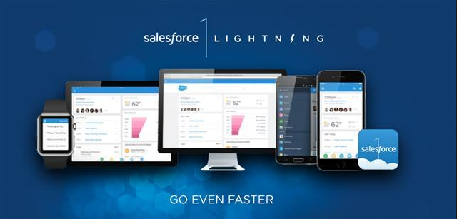

# Lightning to the Nations

  This workshop will introduce you to the Lightning component framework and suite of tools, enabling you to create apps and services even faster on the Salesforce1 Platform.

> **Note** This is a practical workshop, so where ever you see this pencil icon it means there is an exercise for you to complete.  

## Lightning Advantage
  The advantages of Lightning include:
  
- reducing further the need for custom code via Schema builder, Process Builder & App Builder.
- encouraging reusable components via Lightning standard & custom components
- a marketplace for 3rd party components via the Salesforce Component Exchange

  

## Lightning aspects

* Lightning App Builder - a click driven tool for assembling Lightning components into apps, to run on the Salesforce1 Mobile App.

* Lightning Component - a framework for developing single-page applications that can be included in the Salesforce1 Mobile App. Create components wiht JavaScript on the client side and Apex on the server side.

* Lightning Component Extensions (Pilot) - allows you to extend the default Salesforce1 Mobile App UI.
 
* Lightning Process Builder - a click driven tool for building feature rich workflows in Salesforce, minimsing the need for triggers.

* Lightning Schema Builder - visualise all the objects & relationships in your Salesforce Org, creating and modifying custom objects. 

* Lightning Connect - use data from external sources with Salesforce via a powerful point click interface.  Easily connecting your Org with a growning number of OData sources.

> “OData can be considered as the ODBC API for the Web/Cloud” – Open Database Connectivity (ODBC) is a standard API independent of programming language for doing Create, Read, Update and Delete (CRUD) methods on most of the popular relational databases.

> “OData is a data silo buster” 

## Salesforce1 Mobile App

  A mobile app available for Android, iOS and Windows mobile.  A hybrid application that reduced the need for Salesforce customers to build their own mobile app in order to interact with their Salesforce Org.

  Lightning components allow you to build more functionality into your Salesforce1 Mobile Apps, with less coding required.

## Tutorials
* [Lightning Connect](http://developerforce.github.io/lightning-connect-tutorial) - integrate order data from an external data source without writing a line of code or duplicating data in Salesforce
* [Lightning Process Builder](http://leeanndroid.github.io/LightningProcessBuilder/)
* [Lightning Components](http://developerforce.github.io/lightning-components-tutorial)
* [Lightning App Builder](http://developerforce.github.io/lightning-app-builder-tutorial)

## Resources 
* [developer.salesforce.com/lightning](https://developer.salesforce.com/lightning)
* [Lightning Components Cheatsheet (pdf)](https://developer.salesforce.com/resource/pdfs/Lightening_Components_Cheatsheet.pdf)
* Aura component framework documentation via your Org: _https://<instance>.salesforce.com/auradocs_

