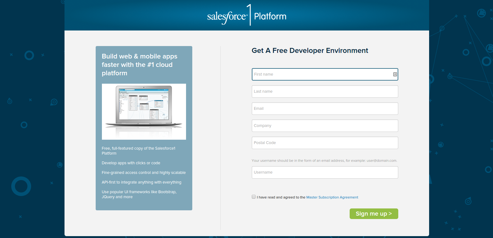

# The Setup 

  In order to follow this workshop, please use a new **Spring15 Developer Org**.  This helps avoid conflicts with existing behaviour in your Org and ensures you have the latest version of Lightning.
  
  Create a new Spring15 Developer Org at: [bit.ly/lightningcomponents](http://bit.ly/lightningcomponents)

> **Info** After you sign up, you will recieve an email containing a link to set a password to access your Salesforce Spring15 Org.

